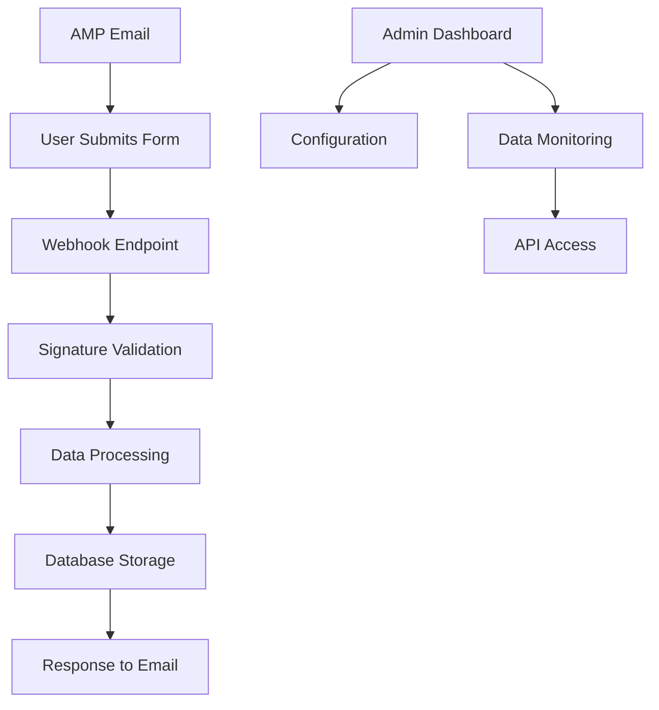

# AMP Email Webhook System - Product Requirements Document

## 1. Product Overview

An AMP email webhook system that receives, processes, and stores form submission data from AMP-enabled emails. The system provides a secure endpoint for handling dynamic email interactions and enables real-time data collection from email recipients.

The webhook serves as a bridge between AMP email forms and backend systems, allowing businesses to capture user responses directly from emails without requiring users to visit external websites.

## 2. Core Features

### 2.1 User Roles

| Role                 | Registration Method      | Core Permissions                                                   |
| -------------------- | ------------------------ | ------------------------------------------------------------------ |
| Email Recipient      | No registration required | Can submit forms via AMP emails                                    |
| System Administrator | Direct system access     | Can configure webhooks, view submissions, manage security settings |
| API Consumer         | API key authentication   | Can retrieve submission data via REST API                          |

### 2.2 Feature Module

Our AMP webhook system consists of the following main components:

1. **Webhook Endpoint**: receives AMP form submissions, validates requests, processes data.
2. **Data Storage**: stores submission data, manages data retention, provides query capabilities.
3. **Admin Dashboard**: displays submission analytics, manages webhook configuration, monitors system health.
4. **API Interface**: provides REST endpoints for data retrieval, supports webhook management operations.

### 2.3 Page Details

| Page Name         | Module Name           | Feature description                                                                   |
| ----------------- | --------------------- | ------------------------------------------------------------------------------------- |
| Admin Dashboard   | Submission Analytics  | Display real-time submission counts, success/failure rates, data visualization charts |
| Admin Dashboard   | Webhook Configuration | Configure endpoint URLs, set authentication tokens, manage CORS settings              |
| Admin Dashboard   | Data Management       | View submission history, export data, configure retention policies                    |
| API Documentation | Endpoint Reference    | Document all available REST endpoints, provide request/response examples              |
| API Documentation | Authentication Guide  | Explain API key generation, token management, security best practices                 |

## 3. Core Process

**AMP Email Submission Flow:**

1. User receives AMP-enabled email with interactive form
2. User fills out form fields within the email client
3. User submits form, triggering POST request to webhook endpoint
4. Webhook validates AMP signature and request authenticity
5. System processes and stores submission data
6. Webhook returns appropriate response to email client
7. User sees confirmation message within email

**Admin Management Flow:**

1. Administrator accesses dashboard via secure login
2. Admin configures webhook settings and security parameters
3. Admin monitors submission data and system performance
4. Admin exports data or integrates with external systems via API

## 4. User Interface Design

### 4.1 Design Style

* **Primary Colors**: #2563eb (blue), #059669 (green for success states)

* **Secondary Colors**: #64748b (gray), #dc2626 (red for errors)

* **Button Style**: Rounded corners (8px), solid backgrounds with hover effects

* **Font**: Inter or system fonts, 14px base size, 16px for headings

* **Layout Style**: Clean dashboard layout with card-based components, sidebar navigation

* **Icons**: Heroicons or similar minimalist icon set

### 4.2 Page Design Overview

| Page Name         | Module Name         | UI Elements                                                                      |
| ----------------- | ------------------- | -------------------------------------------------------------------------------- |
| Admin Dashboard   | Analytics Cards     | Clean metric cards with numbers, charts using Chart.js, responsive grid layout   |
| Admin Dashboard   | Configuration Panel | Form inputs with validation, toggle switches, copy-to-clipboard for webhook URLs |
| Admin Dashboard   | Data Table          | Sortable table with pagination, search filters, export buttons                   |
| API Documentation | Code Examples       | Syntax-highlighted code blocks, interactive request/response examples            |

### 4.3 Responsiveness

Desktop-first design with mobile-adaptive breakpoints. Touch-friendly interface for mobile administrators with optimized table views and simplified navigation.

## 5. Technical Requirements

### 5.1 AMP Email Compliance

* Support AMP4EMAIL specification for form handling

* Validate AMP signatures using Google's public keys

* Handle CORS preflight requests from email clients

* Return appropriate HTTP status codes and response formats

### 5.2 Security Requirements

* Implement AMP signature verification for request authenticity

* Rate limiting to prevent abuse (100 requests per minute per IP)

* Input validation and sanitization for all form data

* HTTPS-only endpoints with valid SSL certificates

* API key authentication for administrative access

### 5.3 Data Requirements

* Store submission timestamp, form data, sender information

* Support JSON and form-encoded data formats

* Implement data retention policies (configurable, default 90 days)

* Provide data export capabilities (CSV, JSON formats)

* Log all webhook requests for debugging and monitoring

### 5.4 Performance Requirements

* Response time under 200ms for webhook endpoints

* Support concurrent requests (minimum 100 simultaneous)

* Database indexing for efficient data retrieval

* Caching for frequently accessed configuration data

