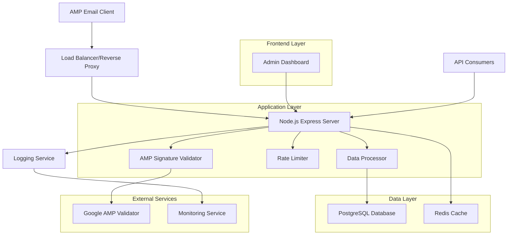
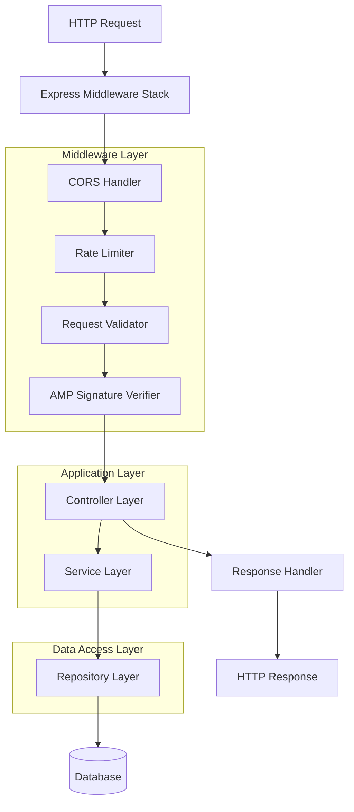
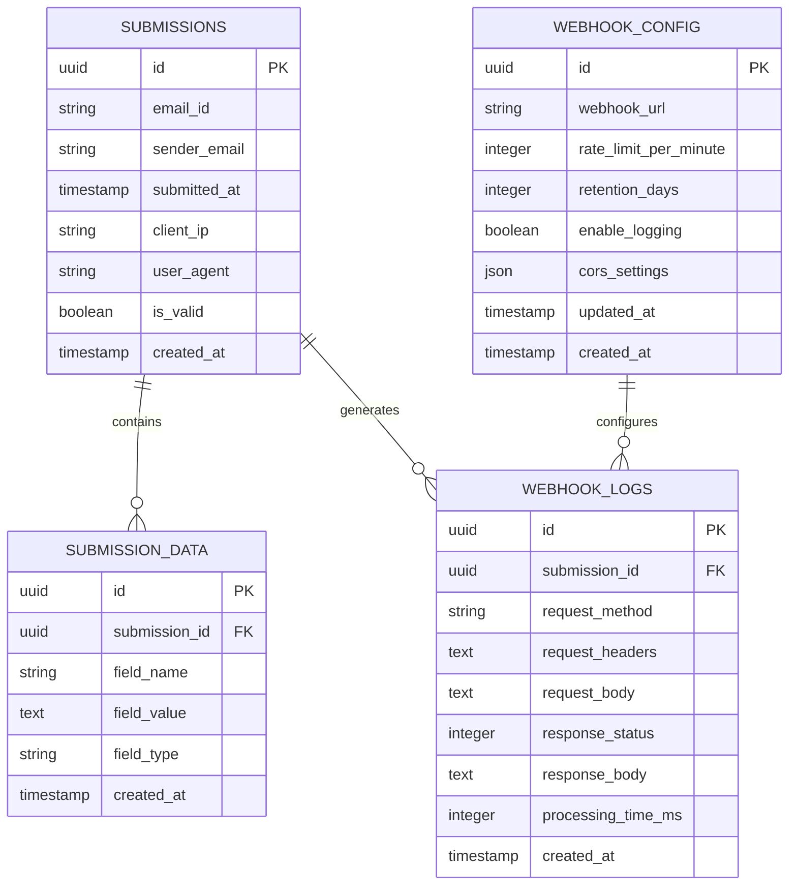

# AMP Email Webhook System - Technical Architecture Document

## 1. Architecture Design



## 2. Technology Description

* **Backend**: Node.js\@18 + Express\@4 + TypeScript

* **Database**: PostgreSQL\@15 (primary) + Redis\@7 (caching)

* **Authentication**: JWT tokens + API keys

* **Validation**: Joi for input validation + Google AMP signature verification

* **Monitoring**: Winston for logging + Prometheus metrics

* **Deployment**: Docker containers + PM2 process manager

## 3. Route Definitions

| Route                        | Purpose                               |
| ---------------------------- | ------------------------------------- |
| POST /webhook/amp            | Main AMP form submission endpoint     |
| GET /webhook/health          | Health check endpoint for monitoring  |
| GET /api/submissions         | Retrieve submission data (paginated)  |
| POST /api/submissions/export | Export submissions in various formats |
| GET /api/config              | Get webhook configuration             |
| PUT /api/config              | Update webhook configuration          |
| POST /api/auth/login         | Admin authentication                  |
| GET /admin/dashboard         | Admin dashboard interface             |

## 4. API Definitions

### 4.1 Core API

**AMP Webhook Endpoint**

```
POST /webhook/amp
```

Headers:

| Header Name         | Type   | Required | Description                                           |
| ------------------- | ------ | -------- | ----------------------------------------------------- |
| Content-Type        | string | true     | application/json or application/x-www-form-urlencoded |
| AMP-Email-Sender    | string | true     | Sender email address                                  |
| AMP-Email-Signature | string | true     | AMP signature for verification                        |

Request Body:

| Param Name | Param Type | Required | Description                    |
| ---------- | ---------- | -------- | ------------------------------ |
| formData   | object     | true     | Form field data from AMP email |
| timestamp  | string     | false    | Client-side timestamp          |
| emailId    | string     | false    | Unique email identifier        |

Response:

| Param Name   | Param Type | Description                  |
| ------------ | ---------- | ---------------------------- |
| success      | boolean    | Submission status            |
| message      | string     | Response message             |
| submissionId | string     | Unique submission identifier |

Example Request:

```json
{
  "formData": {
    "name": "John Doe",
    "email": "john@example.com",
    "feedback": "Great product!"
  },
  "timestamp": "2024-01-15T10:30:00Z",
  "emailId": "email_123456"
}
```

Example Response:

```json
{
  "success": true,
  "message": "Submission received successfully",
  "submissionId": "sub_789012"
}
```

**Get Submissions API**

```
GET /api/submissions
```

Query Parameters:

| Param Name | Param Type | Required | Description                            |
| ---------- | ---------- | -------- | -------------------------------------- |
| page       | number     | false    | Page number (default: 1)               |
| limit      | number     | false    | Items per page (default: 50, max: 200) |
| startDate  | string     | false    | Filter by start date (ISO format)      |
| endDate    | string     | false    | Filter by end date (ISO format)        |
| emailId    | string     | false    | Filter by email ID                     |

Response:

| Param Name | Param Type | Description                 |
| ---------- | ---------- | --------------------------- |
| data       | array      | Array of submission objects |
| pagination | object     | Pagination metadata         |
| total      | number     | Total number of submissions |

**Configuration API**

```
PUT /api/config
```

Request:

| Param Name    | Param Type | Required | Description               |
| ------------- | ---------- | -------- | ------------------------- |
| webhookUrl    | string     | true     | Webhook endpoint URL      |
| rateLimit     | number     | false    | Requests per minute limit |
| retentionDays | number     | false    | Data retention period     |
| enableLogging | boolean    | false    | Enable detailed logging   |

## 5. Server Architecture Diagram



## 6. Data Model

### 6.1 Data Model Definition



### 6.2 Data Definition Language

**Submissions Table**

```sql
-- Create submissions table
CREATE TABLE submissions (
    id UUID PRIMARY KEY DEFAULT gen_random_uuid(),
    email_id VARCHAR(255),
    sender_email VARCHAR(255) NOT NULL,
    submitted_at TIMESTAMP WITH TIME ZONE NOT NULL,
    client_ip INET,
    user_agent TEXT,
    is_valid BOOLEAN DEFAULT true,
    created_at TIMESTAMP WITH TIME ZONE DEFAULT NOW()
);

-- Create indexes
CREATE INDEX idx_submissions_email_id ON submissions(email_id);
CREATE INDEX idx_submissions_sender_email ON submissions(sender_email);
CREATE INDEX idx_submissions_submitted_at ON submissions(submitted_at DESC);
CREATE INDEX idx_submissions_created_at ON submissions(created_at DESC);
```

**Submission Data Table**

```sql
-- Create submission_data table
CREATE TABLE submission_data (
    id UUID PRIMARY KEY DEFAULT gen_random_uuid(),
    submission_id UUID NOT NULL REFERENCES submissions(id) ON DELETE CASCADE,
    field_name VARCHAR(255) NOT NULL,
    field_value TEXT,
    field_type VARCHAR(50) DEFAULT 'text',
    created_at TIMESTAMP WITH TIME ZONE DEFAULT NOW()
);

-- Create indexes
CREATE INDEX idx_submission_data_submission_id ON submission_data(submission_id);
CREATE INDEX idx_submission_data_field_name ON submission_data(field_name);
```

**Webhook Logs Table**

```sql
-- Create webhook_logs table
CREATE TABLE webhook_logs (
    id UUID PRIMARY KEY DEFAULT gen_random_uuid(),
    submission_id UUID REFERENCES submissions(id) ON DELETE SET NULL,
    request_method VARCHAR(10) NOT NULL,
    request_headers JSONB,
    request_body TEXT,
    response_status INTEGER NOT NULL,
    response_body TEXT,
    processing_time_ms INTEGER,
    created_at TIMESTAMP WITH TIME ZONE DEFAULT NOW()
);

-- Create indexes
CREATE INDEX idx_webhook_logs_submission_id ON webhook_logs(submission_id);
CREATE INDEX idx_webhook_logs_created_at ON webhook_logs(created_at DESC);
CREATE INDEX idx_webhook_logs_response_status ON webhook_logs(response_status);
```

**Webhook Configuration Table**

```sql
-- Create webhook_config table
CREATE TABLE webhook_config (
    id UUID PRIMARY KEY DEFAULT gen_random_uuid(),
    webhook_url VARCHAR(500) NOT NULL,
    rate_limit_per_minute INTEGER DEFAULT 100,
    retention_days INTEGER DEFAULT 90,
    enable_logging BOOLEAN DEFAULT true,
    cors_settings JSONB DEFAULT '{"origins": ["*"], "methods": ["POST", "OPTIONS"]}',
    updated_at TIMESTAMP WITH TIME ZONE DEFAULT NOW(),
    created_at TIMESTAMP WITH TIME ZONE DEFAULT NOW()
);

-- Insert default configuration
INSERT INTO webhook_config (webhook_url, rate_limit_per_minute, retention_days, enable_logging)
VALUES ('https://your-domain.com/webhook/amp', 100, 90, true);
```

## 7. Security Implementation

### 7.1 AMP Signature Verification

* Implement Google's AMP email signature verification

* Validate requests using Google's public keys

* Reject requests with invalid or missing signatures

### 7.2 Rate Limiting

* Implement Redis-based rate limiting

* Default: 100 requests per minute per IP

* Configurable limits via admin interface

### 7.3 Input Validation

* Validate all incoming data using Joi schemas

* Sanitize HTML content to prevent XSS

* Implement maximum payload size limits

### 7.4 CORS Configuration

* Allow specific email client origins

* Support preflight OPTIONS requests

* Configurable CORS settings via admin panel

